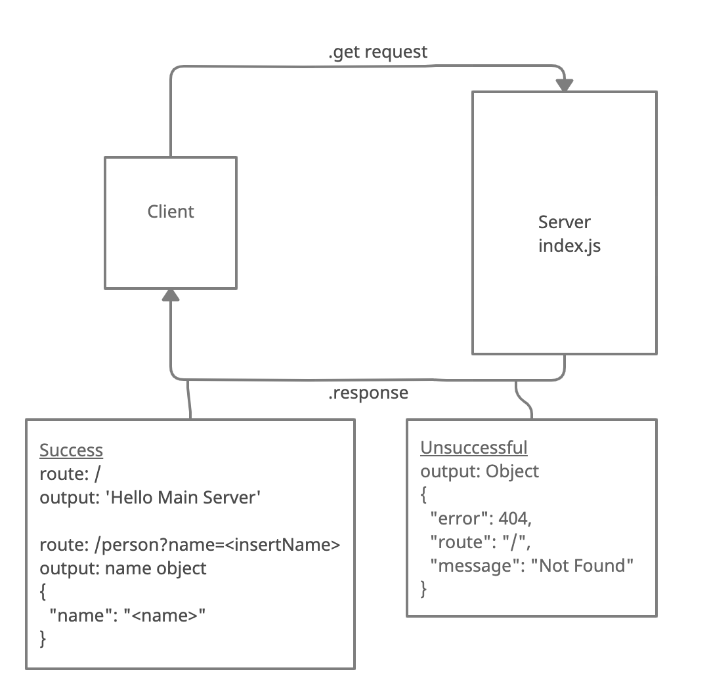

# basic-express-server

## Current LAB - 02

## Express Server Testing

From a business requirements standpoint, we will be building a basic Express server using best practices, including server modularization, use of middleware, and tests. This is a basic express server.

### Author: Mark Thanadabouth

### Collaborators: Alex W(Instructor), Heather B, Charlie F, 

#### Links and Resources
* [Deployed Link (devBranch)](https://markt-basic-express-server-dev.herokuapp.com/)
* [Deployed Link (mainBranch)](https://mt-basic-express-server-prod.herokuapp.com/)

### Setup

#### `.env` requirements
- `PORT` - Port Number

#### Running App
- `npm start` or `npx nodemon`

Endpoints:
- `/`
> Hello Main Server
- `/person?name=<insertName>`
> Returns 'name' object 

#### Tests
- `npm test`

### UML
> 

### Reflections and Comments
* Start date (09/28)

### LAB - 02

Name of feature: Express Tests

Estimate of time needed to complete: 2 Hours

Start time: 4pm (09/29)

Finish time: 7:30pm

Actual time needed to complete: about 2.5 hours
